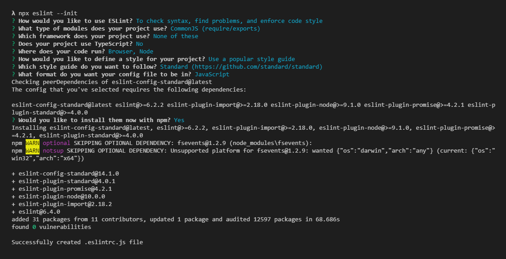

# Using ESLint with Webpack 4 and JavaScript Standard Style guide

__ESLint installation__

Install `eslint` from npm, if you haven't already:
````bash
npm install eslint --save-dev
````

- more about [ESLint](https://eslint.org/)

Set up a configuration file:

````bash
npx eslint --init
````
This command will run the ESLint CLI



__Note:__

We choose the `Standard` style guide in the prompt "? Which style guide do you want to follow?"

- more about [JavaScript Standard Style](https://standardjs.com/readme-fr.html#comment-ignorer-des-fichiers)

This will creates the `eslintrc.js` into the root directory

__Ignoring files__

We tell ESLint to ignore specific files and directories by creating an `.eslintignore` file:
````bash
touch .eslintignore
````

- more about [Ignoring Files and Directories](https://eslint.org/docs/user-guide/configuring#ignoring-files-and-directories)

In addition we configure the `.eslintignore` file:

````
# /node_modules/* and /bower_components/* in the project root are ignored by default

# Ignore built files except build/index.js
#build/*
#!build/index.js

# Ignore dist folder with all files inside
dist/*
````
__Using ESLint with Webpack__ 

Install eslint-loader from npm:

````bash
npm install eslint-loader --save-dev
```` 
- more about [eslint-loader](https://webpack.js.org/loaders/eslint-loader/)

__Usage:__

we add `eslint-loader` into the webpack configuration file:

`webpack.config.js`
````javascript
module.exports = {
  // ...
  module: {
    rules: [
      {
        test: /\.js$/,
        exclude: /(node_modules|bower_components)/,
        loader: 'eslint-loader',
        options: {
          // eslint options (if necessary)
        },
      },
    ],
  },
  // ...
};
````

That's it !

__Author:__

* **Thomas G. aka Drozerah** - [Github](https://github.com/Drozerah)

__License:__

* ISC


